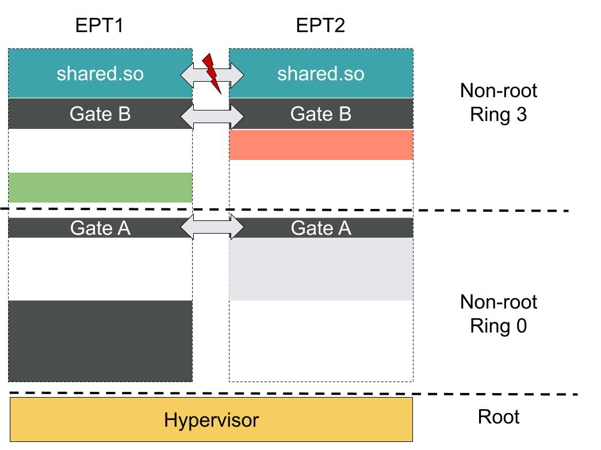
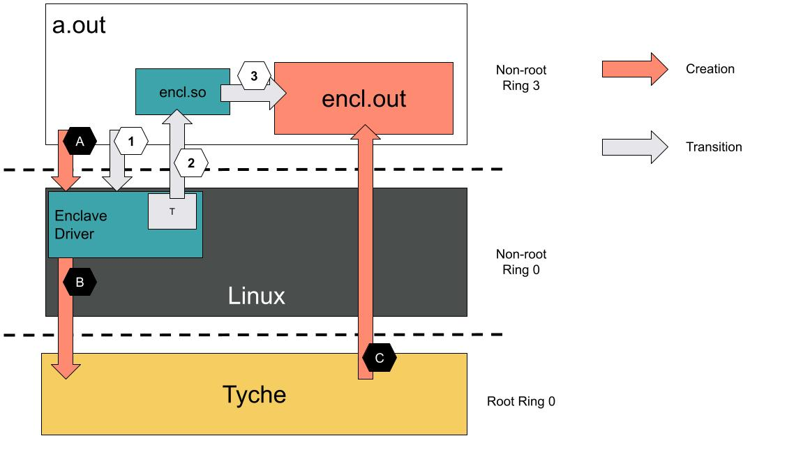
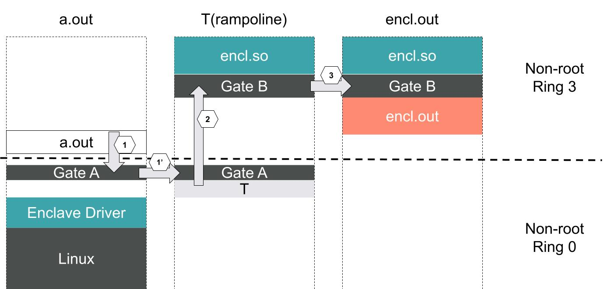

# Enclaves in Tyche

This folder defines a kernel module that provides an API to create an enclave, i.e., a non-guest-virtualized confidential execution environment.

The kernel module interacts with tyche via vmcalls to build and transition into a confidential execution environment.

This document provides: 

1. A high-level desription of a tyche enclave.
2. Some background knowledge about VMFUNC.
3. Enclave creation with the Tyche Enclave Driver. 
4. Transitions between Domains.
5. Dynamic Changes to Enclave address space.
6. Attestation

## 1. Enclave Description

For simplicity, assume in the remainder of this document that a trust domain is equivalent to an EPT table.
That definition allows for multiple address spaces to coexist within a trust domain (i.e., several page tables, processes etc.).

An enclave is a nested trust domain whose execution environment guarantees confidentiality and integrity.
Confidentiality means that enclave is the only enntity able to read enclave memory.
Integrity means that the enclave is the only entity able to modify the content of enclave-memory.

An enclave is granted memory resources from its *managing trust domain*, e.g., the untrusted OS or application, for its exclusive usage.
These resources hold the enclave's confidential content and are solely accessible to the enclave.

The managing domain can further map resources into the enclave, with its approval.
Such resources are shared between the managing domain and the enclave and are not confidential or integrity protected.

Unlike Intel SGX, an enclave can execute in ring 3, ring 0, or both.
This allows our enclave design to emulate both SGX and TrustZone.

Unlike Intel SGX, an enclave only has access to the untrusted memory shared by the managing domain (rather than the entire ring 3 application memory).

Similar to SGX, we can allow multiple enclaves to be instantiated from a single user process (`managing domain`).
Unlike SGX, we do not have a strict requirement that address spaces of the enclaves and the user process do not overlap, thus giving us virtually an infinite number of possible enclaves per user process (in practice we are limited by the amount of resources on the machine, but you get the gist).
That also removes the burden of the Intel SGX SDK to have enclave code compiled as a dynamic library, i.e., we are able to load even static, non PIE programs with predefined virtual mappings.
A program that instantiates multiple enclaves gets, for each of them, a reference handle, similar to UNIX file descriptors, that identifies an enclave within the context of that program.

## 2. Background on VMFUNC

This section assumes the reader is familiar with Intel VT-x a notions such as VMCS and EPTs. 

Intel VT-x provides an instruction called `VMFUNC` to expose hypervisor and hardware supplied functions to VMs.
The `VMFUNC` instruction can be called from any non-root ring (*VERIFY THAT THIS IS THE CASE*).

At the moment, there is only one such function available and it implements an EPT switch in hardware.
This function takes as argument an index within the range 0 to 512.
The function then accesses the VM's VMCS `ept_table` array at the provided index and replaces the current EPT root with the value found in the array. 
As all of this is implemented directly in hardware, the rest of the VM's state is left unchanged.

Once enabled, `VMFUNC` EPT switching capability can only be used in a meaningful way if the VM's state at the moment of the execution of the `VMFUNC` instruction is also valid within the target EPT.
For example, `rip` and `cr3` need to be valid values in the target EPT as the execution will simply proceed with the next instruction after `VMFUNC`. 
Figure 1 provides a visual description of `VMFUNC` EPT switching.

|  |
|:---------------------------------:|
|  <b> Fig. 1 - VMFUNC Example</b>  |

Figure 1 presents two EPT address spaces within the same VM.
Transitions between the two address spaces succeed only if, at minima, if the virtual address of the `VMFUNC` instruction is valid in both address spaces.
Implicitely, this also requires the `cr3`s to have the same guest physical addresses, but allows them to have different EPT mappings (i.e., different host physical addresses).
More generally, there is no requirement for any guest virtual or physical address to be backed by the same host physical pages. 

On Figure 1, `Gates` are valid portions of code with trampolines that allow to switch between the two EPTs.
Executing a `VMFUNC` from any of the yellow, orange, dark grey, or light grey boxes not marked as Gates would result in a page fault as the corresponding virtual addresses are not mapped.
Executing a `VMFUNC` from the `shared.so` region could result in weird behaviours as both address spaces have valid memory mappings, but that code might not be written to correctly handle the transition between the two domains.


There are a few observations we can make from this high-level description of vmfunc: 

1. There is a limit on the number of address spaces we can transition to (511 not counting the current one).
2. If not careful, one might allow arbitrary transitions between address spaces.

Our design addresses both issues by introducing a *T*rampoline address space.
The Trampoline, noted `T`, and described below in more details solves these two issues in the following way:

`T` has access to the VMCS's EPT table and can dynamically patch it with new entries.

`T`'s virtual address space has overlaps with both of the other address spaces, with one page implementing a `Gate` that allows safe `VMFUNC` transitions into/from `T` with enclaves. 

## 2. Enclave Creation with the Tyche Enclave Driver for Linux

### Overview

In this section we describe the *static* part of tyche's support for enclaves, i.e., the creation of an enclave.
The protocol allows for dynamic changes in the set of resources available to an enclave.
These are described in Section 5 of this document.

As Tyche's implementation needs to remain as simple as possible in order to be verified and avoid the introduction of bugs, we rely on a Linux Kernel Driver `enclave driver` to expose high-level abstractions and create enclaves.
This separation of concerns allows Tyche to remain agnostic of page table mappings, abbreviated as `cr3`, while giving us access, through the driver, to guest virtual to physical mappings.

Figure 2 provides an overview of a Linux guest executing a user program `a.out` that spawns an enclave `encl.out` using our `enclave driver` kernel module.
The figure provides letter-labeled arrows for enclave creation and number-labeled arrows for transitions between the two trust domains (`a.out` and `encl.out`).

Figure 3 represents the three address spaces that belong to the three trust domains `a.out`, the `T` domain (as brefiely mentionned in the background section), and `encl.out`, in a vein similar to Figure 1.
For ease of understanding, the transition arrows from Figure 2 are also represented on Figure 3 with the corresponding number-labels.

|  |
|:--------------------------------------------:|
|  <b>Fig. 2 - Creation and Transition Overview</b>   |


|  |
|:----------------------------------------------------------------:|
|       <b>Fig. 3 - Address Space for each Trust Domain</b>        |

### Creation

The enclave creation protocol is represented by the orange arrows labeled `A, B, C` and involves interactions between a program, here `a.out`, the `enclave driver`, and `tyche`.

Interactions between `a.out` and the `enclave driver` (arrow `A`) are implemented via `ioctl`s.

Interactions between the `enclave driver` and `tyche` (arrow `B`) are implemented via `vmcall`s.

Arrow `C` represents tyche configuring the hardware, i.e., creating or modifying EPTs.


A typical enclave creation and execution is implemented as follows:

#### A. Creating the enclave.

The user program `a.out` interacts, via `ioctl`s, with the `enclave driver` to create the `encl.out` enclave.

First, `a.out` dynamically loads (e.g., mmaps or dynload) the `encl.out` program in its address space.
This allows to reserve virtual memory space in `a.out` address space that the driver will carve out later to create the enclave.

The enclave creation protocol starts with a call to create a new enclave.
The call should provide pre-defined `GATES` virtual addresses in the `encl.so` library that reference context switching and utility routines provided by the library.
This returns an `encl_handle` that solely identifies this enclave. 

The `encl_handle` is then used by `a.out` to reference this particular enclave and to add memory regions (pages) to it.
To add a region, `a.out` makes calls with the following format to the `enclave driver`:

```
struct AddRegion {
  /// Unique enclave capability
  encl_handle: u64,
  
  /// Start address. Must be page aligned.
  start: u64,
  
  /// End address. Must be page aligned
  end: u64,
  
  /// Protection flags (RWX) for this region.
  flags: u64,
  
  /// Type of mapping: Confidential or Shared.
  type: enum RegionType
}
```

The driver has access to the kernel's metadata and thus identifies, for each region, the collection of guest physical frames `PhysFrames` backing them.
The `PhysFrames` are later ( Subsection B) translated into host physical frames and mapped by tyche into the enclave's EPTs.
Furthermore, if `AddRegion.type == Confidential`, the `PhysFrames` are removed from the current domain's EPT.


#### B. Interactions between the driver and Tyche

The `enclave driver` interacts, via `vmcall`s, with `tyche` to effect the creation of `encl.out` trust domain and its corresponding set of EPTs.

Tyche is agnostic to the `cr3` and only deals in trust domains and EPTs. 
As a result, the `enclave driver` is responsible for the guest virtual to guest physical translations.
The driver is also responsible for instantiating enclave page tables for the enclave, which allows to protect the enclave's integrity by preventing `encl.out`'s mappings from being modified by the `a.out` domain.

This enclave page table needs to have the following properties:

* The guest physical address of `enclave cr3` has to be the same as `cr3`.
* The `enclave cr3` and `cr3` host physical addresses (as well as intermediary page table entries) must be different.
* The PhysRanges used in `enclave cr3` page tables must be granted from the `a.out` domain to the `encl.out` domain with confidential access.
* The leaf mappings for any `AddRegion.start` virtual address need to have the same guest physical address in both `cr3` and `enclave cr3` and be backed by the same `PhysRange` in the respective EPTs.

The first requirement allows for a smooth `vmfunc` transition between the two domains.
It is not a strict requirement (as explained later in this document) but rather an early optimization that might enable even faster transitions between domains.

The second requirement ensures that concurrent modifications to the `a.out` domain's page tables will not affect the `encl.out` mappings.

The third requirement ensures that `a.out` is unable to modify the `encl.out` mappings.

The fourth requirement ensures that `encl.out` is initialized with the correct content and that both domains can exchange information via shared mappings. 

This protocol implies that the driver must be able to allocate fresh pages from the kernel and grant them to the `encl.out` domain via interactions with tyche using vmcalls. 

Note here that the `enclave driver` can batch operations (i.e., buffer them before performing a vmcall).
This reduces the number of vmexit drastically.

Finally, the driver is also responsible for registering a special confidential structure, called `ECS` for enclave control structure that contains, at minima, the following information:

```
struct ECS {
  /// The enclave page table root.
  cr3: u64,
  
  /// The entry point virtual address for the enclave.
  entry_point: u64,
  
  /// Stack pointer virtual address for the enclave.
  stack: u64,
  
  /// Other useful entries, e.g., a frame buffer to save state on transitions.
  /// State buffers are important to validate transitions within the enclave 
  /// and avoid confused deputy attacks, counters to limit concurrent execution
  /// inside a trust domain, etc.
  /// This might also be where we store pprivate encryption keys.
  ...
}
```
Note that the `ECS` is partially independent from tyche's monitor, i.e., we could have different `ECS` implementations for different libraries, with different sets of fields.
The only common implementation requirement is the type (described in the next section) for `ECS` pages.

Also note that for the moment we do not describe interrupt handling within the enclave.
Later, once we have a basic prototype, we plan to allow the enclave to decide whether to catch its own interrupts (and thus setup its own IDT and GDT), forward them to the managing domain, or directly let the managing domain handle them.


The kernel driver is also reponsible for creating a per-guest address space trampoline, marked as `T` in Figures 2 and 3. 

This trampoline is common to all enclaves within the `a.out` address space, is backed by confidential pages, and has access to all the enclaves `ECS` structures.
As seen on Figure 3, it also has the `encl.so` library mapped in user space.
The trampoline plays an important role in the implementation of secured transitions and is described in Section 4.

The final operation in an enclave creation process is called `Sealing`.
This operation notifies tyche that the driver is done configuring the enclave, marks the `ECS` as being a valid target for a transition.

### C. Tyche instantiation.

Tyche creates a new trust domain and instantiates a new EPT table for the `encl.out` domain. 
Part of tyche's job is to translate the supplied guest physical addresses into host physical ones and modify EPTs accordingly.
As part of Arrow `B`, tyche receives messages of the form:

```
struct VMCALL {
  /// The unique enclave identifier.
  encl_handl: u64,
  
  /// The guest physical address start of the region.
  start_guest_phys: u64,
  
  /// The guest physical address end of the region.
  end_guest_phys: u64,
  
  /// The type of mapping, i.e., confidential, shared, trampoline, or ECS.
  type: enum Type,
}
```

Tyche translates this `PhysRange` supplied by the Linux Driver into a collection of host physical pages, `HostPhysRange`.
If the pages are marked confidential, it removes them from the `a.out`'s domain EPTs, ensures that none of the `HostPhysRange` are available to any other domain, and maps them into the enclave's EPTs.

At this stage, it is crucial for Tyche to have an easy way of ensuring that confidential pages are  mapped only in the enclave's EPT.
Tyche should further guarantee that any attempt to map them anywhere else would result in a fault.

A third type of mapping is marked as `trampoline`. 
Trampoline pages can only be mapped in `T` and all of the enclaves derived from `a.out` address space.
This type is used for the `encl.so` library  and `Gates` on Figure 3.

A fourth type of mapping is marked as `ECS`.
`ECS` can only be mapped in `T` and the *current* enclave and only once the enclave has been `Sealed`.
This prevents transitions into an unsealed enclave.


### 4. Transitions between the domains

#### Overview and `T`

The transition between domains involves the `T` domain described in Figure 3.

`T` acts as a shield that circumvents two issues intrinsic to `vmfunc`: 

1. A 512 limitation to EPT table entries in the VMCS.
2. A uncontrolled access to the `VMFUNC` instruction.

At any given point, the VMCS is configured to only allow one target for the `VMFUNC` operation.
When the VMCS is not in `T`, the target can only be `T`'s EPT.
Specifically, when not in `T`, the only two entries in the EPT table are the current domain and `T`.
Furthermore, the EPT table is not writable from any domain except `T` (and tyche).

When the VMCs is in `T`, `T` dynamically patches its own EPT table to replace the caller's EPT with the target's EPT if and only if the transition is allowed, i.e., if the target's `ECS` is sealed (done being configured) and if it accepts calls from this caller.
It then performs a controlled transfer into the target domain using `VMFUNC` with index 2.

To guarantee the correctness of control transfers between domains, state must be properly saved and restored upon gate transition.
`T` must further validate any transition from a caller to a callee.
We distinguish between two types of transitions:

1. A call: A domain calls another domain.
2. A return: A domain returns to its caller. 

In order to implement `2`, `T` must keep track of `1`. 
This can be done with internal state, stored within the `ECS` for example.

`T` further ensures the scrapping of registers.
Note that this could be configured on a per-enclave basis, i.e., each `ECS` could speficy which registers should be cleared and which should be preserved, i.e., define its own ABI.
This can be done efficiently with a bitmap and would allow the fast forwarding of arguments/return values between domains without relying on shared memory mappings.

#### Step-By-Step Transition

This subsection describes the step-by-step transition from the `a.out` domain into `encl.out`.

The `a.out` domain performs an `ioctl` call to the `enclave driver`, represented by Arrow `1` in Figures 2 and 3, to effect a control transfer into the enclave.

The `enclave driver` performs a `VMFUNC` at `Gate A` to transition into `T`, as showned by Arrow `1'` in Figure 3.

`T` performs its bookeeping, validates and creates the correct EPT Table entry, and performs a control return (e.g., `iret`)  into the userspace `encl.so`. This is represented by Arrow `2` in Figures 2 and 3.

The `encl.so` library has a routine `Gate B` that performs a `VMFUNC` to transition into the `encl.out` domain.
This is visible in Figures 2 and 3 with Arrow `3`.

We are now executing inside the enclave.

#### Transition Discussion

Note that the above description of the transition mechanism is not final and needs to be experimented with.
This is a first attempt at providing a secured controlled transition between domains that avoids the use of `vmcalls` on transition paths.

An alternative solution would eschew all these steps and directly perform a vmcall to tyche, letting tyche in charge of managing state save and restore at the `vcpu` level.
This alternative, however, increases the burden on our small monitor and seems, apriori, more costly.
Nevertheless, it could be implemented for comparison or as a first step to simplify the development.

Note also that, on Figure 3, `T` resides inside its own domain, with both kernel space and user space addresses.
While `encl.so` could be mapped inside the kernel address space, we believe it is preferable ensure the enclave's freedom to manage its own kernel space as it sees fit and not impose any virtual address layout.
We further believe transitions should be from user space to user space as an extra security guarantee.
None of these restrictions is, however, intrinsic to tyche's design and thus, if new information would justify doing so, we could allow kernel space transitions in and out of the enclave.

Section 3 (Enclave creation) mentions requirements for `enclave cr3` and `cr3`.
As demonstrated by the transition mechanism, the `cr3` guest physical address of `a.out`, `T` in user space, and `encl.out` must have the same values.
A slightly more complicated logic in `T` would allow to break the requirement `gpa(enclave cr3) == gpa(a.out cr3)`.
We however wish to keep that equality valid for the moment as we hope to be able to further optimize domain transitions to allow direct transfers from `a.out` into `encl.out` for specific (less flexibile) enclave instantiation.
Without going into details, we could have a more restrictive enclave deployment that freezes part of `a.out` address space at the EPT level (e.g., making certain page tables RO and trapping on `cr3` writes) to make sure nothing can be mapped into the virtual space used by the enclave or overwritting Gates. 
This in turns would allow secured control transfers directly from `a.out` to `encl.out` without the use of the trampoline.

### Dynamic updates to the Enclave

All the previous sections describe the *static* configuration of an enclave, i.e., its creation and the transition into it.
These previously described operations are single-sided, i.e., they do not require synchronization between trust domains.

Tyche and the `enclave driver` allow for dynamic changes to the set of resources mapped or granted to the enclave.
These dynamic changes require both the `managing domain` and the enclave to participate in a negociation protocol called `NProt`.

The details of `NProt` are yet to be determined but will rely on predefined routines installed in `encl.so`.
The gist is the following: 

For any update to the enclave resources, i.e., adding or removing, initiated by either parties, tyche needs to preserve two invariants: 1) the conservation of the guarantees (confidentiality and integrity) of the enclave and 2) the prerogative of revocation for the `managing domain`.

In the revocation case, initiated by the `managing domain`, tyche ensures that a scrapping & terminating routine is called from the enclave before returning the resource.

In the mapping or self-initiated revocation case, an `NProt` round is initiated between the manager and the enclave.
Tyche acts as an intermediary that reserves resources to be transfered, asks for the receiving domain's approval, and installs them if and only if the receiving domain allows it.

### Attestation

While tyche itself is attested using TPMs and cannot do without them, the enclave measurement is independent of any hardware (i.e., it can rely on it or not).

Each domain can register a set of guest physical regions to be included in the measurement.
From tyche's point of view, this is very simple to implement.

For enclave measurements, simply measuring the content of physical pages holding enclave code, i.e., `encl.out`, and the `encl.so` is not enough. 
We also need to describe the original virtual address space layout in a way that is indepedent from the virtual memory offset and the physical memory mappings.
To do so, we propose an approach similar to ELF PIE to describe virtual memory regions available inside the enclave (both user and kernel space, both corresponding to the `ECS` value for `cr3` at sealing time, i.e., we allow later modifications to the layout).
For physical mappings, we use unique monotonically increasing identifiers for physical pages.
This allows to detect double mapping of physical pages while staying independent of abosulte physical address values.

```
Virt Memory         | Access Rights | Physical Frame indices |
0x1000 -- 0x5000    | RWX           | 0, 1, 0, 2             |

```

This memory layout measurement is taken at sealing time with the help of the `enclave driver`, is part of the attestation and thus the hash generated and signed by tyche.
Tyche could further include obfuscated (i.e., replacing physical addresses -- both guest and host -- with indices) summaries of operations performed before sealing and enclave. 

The `Attestation` is the enclave's signed measurement and is injected in the address space of the enclave as confidential pages, and referenced by the `ECS`.   

A remote party communicating with an enclave and performing an attestation would thus:

1. Contact Tyche, ask for the hardware measurement, and ask for a public key for an enclave.
2. Contact the enclave, ask for the `Attestation`.
3. Verify the signature and hash of the `Attestation`.

Details must be fleshed out, but this is a first overview of the attestation.
