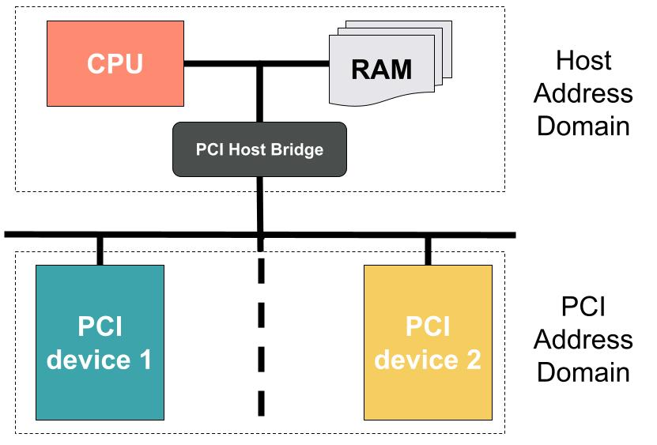

# Discovering and mapping PCI/PCIe devices

Tyche needs to enumerate, configure, and select which PCIe devices will be exposed to the Linux guest.
It further needs to correctly configure the corresponding IO MMU(s) to protect itself (and enclaves) from the untrusted Linux Guest.  

This article describes all the steps required to correctly configure PCIe devices in our hypervisor.
Hopefully, this gives a complete self-contained overview.

The article is organized as follows:

1. General Overview 
2. What we get at boot-time.
3. Parsing PCIe configurations.
4. IO MMU configuration.

## General Overview 

### PCI - Peripheral Component Interconnect

PCI is a local computer bus to attach hardware devices in a computer.
PCI devices attached to the bus are usually assigned addresses in the processor's address space.
PCI has three address spaces:
1. memory
2. I/O address
3. configuration

Memory addresses can be either 32 or 64 bits. 

I/O addresses are used for compatibility with Intel's x86 I/O port address space.

PCI configuration space holds special per-device configuration registers.
This registers are used to configure devices memory and I/O address ranges.

##### Topology

The PCI/PCIe topology is arranged as a tree, where each node is uniquely
identified by their bus, device, and function identifiers, noted in the
`bus:device.function` format. PCIe introduces segments groups to enable large
system to go beyond the 256 buses limits, in which case the format becomes
`segment:bus:device.function`. For most systems the only segment is segment 0.

The bus is encoded on 8 bits, the node on 5 and function on 3, giving 16 bits of
address space for PCI devices. The segment is encoded on 16 bit itself, raising
this limit to 32 bits on PCIe systems.

Intermediate nodes in the tree are PCI bridges, used to connect two buses. The
incoming bus is called _primary_, the outgoing bus is called _secondary_, and
the highest bus ID that is a descendent of the secondary bus is called the
_subordinate_. Therefore, a bridge is on the path to any buses in the range
[secondary, subordinate].

#### Enumeration

At boot-time, the BIOS scans devices and assigns memory and I/O address ranges.
This is called Bus enumeration and might be done by the Operating System as well.
The enumeration consists in attempting to access all possible configuration spaces (see below).
When a read succeeds, the BIOS or OS writes all ones to its `Base Address Registers`, reads the device's requested memory size, and programs the memory-mapped addresses and I/O port addresses into the device's BAR configuration registers.
Each PCI device function can implement up to 6 BARs, describing between 16 bytes and 2 GB, located below the 4GB address space limit, if bits 2:1 are 0x0, or optionally above in 64 bits mode if bits 2:1 are 0x2.



#### Legacy PCI addressing

In Legacy PCI, each device on the bus has a configuration space of 256 bytes, which can be addressed with its 16 bits `B/D/F`:
```
PCI bus: 8 bits | Device: 5 bits | Function: 3 bits  
```

The first 64 bytes of the device configuration are standardized, while the rest is vendor specific.

The configuration of this 256 bytes can be done via I/O addresses via the Configuration Access Mechanism (CAM).
This relies on two registers:

`CONFIG_ADDRESS` (`0xCF8`) holds the destination address:
```
0x80000000 | bus << 16 | device << 11 | function <<  8 | offset
```

`CONFIG_DATA` (`0xCFC`) is a 32 bit register holding the data to be written. 

#### PCIe - PCI Express

PCIe Is the de-facto standard on computers nowadays, it allows high bandwidth
communication with devices.

PCIe extends the configuration space from 256 bytes for PCI to 4096 bytes (i.e.
a full x86 page). The extended space cannot be accessed through the legacy PCI
I/O ports method, but uses memory mapped I/O instead. The beginning of the
configuration region can be found in the system's [ACPI](acpi.md) `MCFG` table.

TODO some more info

#### Links

- [OSDev PCI](https://wiki.osdev.org/Pci)
- [OSDev PCIe](https://wiki.osdev.org/PCI_Express)
- [Wikipedia PCI configuration space](https://en.wikipedia.org/wiki/PCI_configuration_space)
- [PCI BAR size](https://stackoverflow.com/questions/19006632/how-is-a-pci-pcie-bar-size-determined)

# Rust BootLoader BootInfo 

The rust [bootloader](https://github.com/rust-osdev/bootloader) used by tyche abstracts over the differences between BIOS and UEFI booting to supply the kernel's entry point with the appropriate information. 

