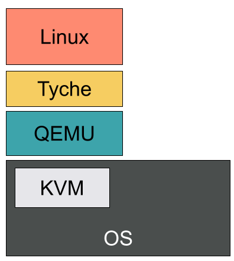
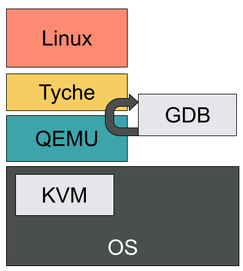

# The Challenges of Debugging a Guest VM

Most (system) programmers heavily rely on debuggers to understand their program's behaviour and fix bugs.
A debugger allows to set breakpoints, print the machine's state (e.g., registers), disassemble code, inspect the program's memory, and many other useful things.
Unfortunately, our favorite debugger, GDB, seems to get slightly confused when attaching to a qemu session running tyche running a guest VM (here Linux or a static C program).

This article lists the problems we faced when trying to use GDB as is to debug Linux running on top of tyche and the solution we adopted to get back some of debugger's functionalities, namely:

1. Nested-guest symbols.
2. Setting breakpoints on nested-guest functions using guest addresses/symbols.
3. Dumping arbitrary memory content using nested-guest addresses.
4. Post-crash inspection of memory content.
5. Dumping Linux's kernel print buffer.

We are, however, still missing a few valuable features:
1. Performing a backtrace.
2. Support for arbitrary memory relocations.

## A Bit of Terminology

Before diving into the instricacies of the debugger, it is important to agree on the meaning of specific terms used throughout this article.

*QEMU*: QEMU is a machine & userpace emulator and virtualizer capable of integrating with hypervisors.

*KVM*: Kernel-based Virtual Machine allows user space programs access to hardware virtualization features.

When working with nested-virtualization, it can be hard to understand what terms such as `guest` and `host` refer to, as they are highly context-dependent.
Generally speaking, the `host` is responsible for providing a virtual environment in which the `guest` executes.

This article describes issues we faced while in active development.
Thus, in this context, the `host` is the OS running QEMU, the `guest` is Tyche, and the `nested-guest` is the Linux instance loaded by Tyche.



## To Debug with QEMU

QEMU has support for gdb's remote-connections and allows to debug `guests` (here, tyche).
Most functionalities are available and it only requires a few [extra steps](https://qemu-project.gitlab.io/qemu/system/gdb.html) compared to a regular gdb debugging sessions.
QEMU even supports switching back and forth between virtual and physical guests addresses.
With this simple setup, we are able to debug tyche code.



Unfortunatly, things get a little more complicated once tyche starts running nested virtual. 
GDB is unable to understand the virtual memory mappings set via EPTs and therefore rejects any memory dump (see image below).

## Getting Back Debugging Features

### Symbols

Tyche embbeds, at compile, the bytes of the nested-guest's ELF file.
As a result, only the tyche symbols are available in the debugging environment.

A simple fix consists in loading the nested-guest source file along side tyche's debug information.

```
add-symbol-file nest-guest-elf
```

### Breakpoints

Software breakpoints are incompatible with nested-guests.
They usually overwrite a virtual address with a special instruction that triggers an interrupt caught by the debugger.
In our case, GDB considers any virtual address to be invalid and thus cannot set the breakpoint properly.

Hardware breakpoints, i.e., `hb`, leverage hardware support and seem to work just fine even when the nested-guest executes.
Note that there is a limited number of available breakpoints.

For convenience (and to avoid mistakenly setting a software breakpoint) we alias `b` to `hb`.
GDB does not allow direct aliasing of basic commands, but allows name shadows with functions:

```
define b:
	hb $arg0
end
```

With this and the symbols available, we get our breakpoints back, even within the nested-guest functions.

### Dumping Memory Content 

This is the trickiest part.
GDB does not understand the virtual memory layout once within the guest and errors on any attempt to dump memory.
Switching to physical addresses is annoying as we would need to do the address translation by hand.
Even worse, while within the nested-guest, tyche's symbols no longer correspond to valid addresses and therefore cannot be printed either.

Our solution is a (hacky) simple one that relies on QEMU's ability to map a guest's memory to a file on the local disk.
We then leverage this and a bit of python scripting to create a remote debug server capable of dumping memory content.

#### File-backed Guest Memory

QEMU allows the creation of memory-backend-files that contain the guest's memory.
To create a guest with `6G` of memory whose default RAM is back by the file `/tmp/tyche`, we simply need the following arguments when invoking QEMU:

```
# Give 6G of RAM to the guest
-m 6G 
-object memory-backend-file,id=pc.ram,share=on,mem-path=/tmp/tyche,size=6G
-machine memory-backend=pc.ram
```

It is important that both the sizes and id match.
Furthermore, in our example, we decided to file-back the default RAM.
QEMU allows you to create extra memory regions with their own identifiers, that can be splitted into separate files.

We now have the full (live) content of our guest's memory, but it's still just a bunch of bytes.
How do we distinguish between functions and variables, or associate file offsets with symbols?

#### Mapping symbols to bytes

