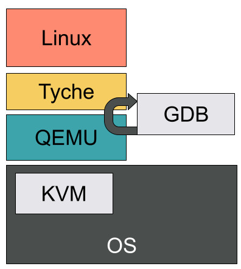
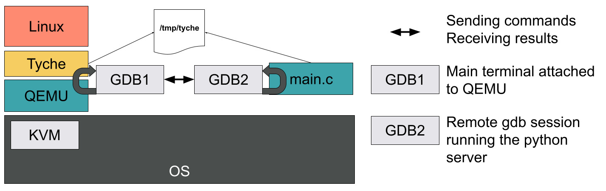

# The Challenges of Debugging a Guest VM

Most (system) programmers heavily rely on debuggers to understand their program's behaviour and fix bugs.
A debugger allows to set breakpoints, print the machine's state (e.g., registers), disassemble code, inspect the program's memory, and many other useful things.
Unfortunately, our favorite debugger, GDB, seems to get slightly confused when attaching to a qemu session running tyche running a guest VM (here Linux or a static C program).

This article lists the problems we faced when trying to use GDB as is to debug Linux running on top of tyche and the solution we adopted to get back some of debugger's functionalities, namely:

1. Nested-guest symbols.
2. Setting breakpoints on nested-guest functions using guest addresses/symbols.
3. Dumping arbitrary memory content using nested-guest addresses.
4. Post-crash inspection of memory content.
5. Dumping Linux's kernel print buffer.

We are, however, still missing a few valuable features:
1. Performing a backtrace.
2. Support for arbitrary memory relocations.

## A Bit of Terminology

Before diving into the instricacies of the debugger, it is important to agree on the meaning of specific terms used throughout this article.

*gpa - gva ; hpa - hva *: guest physical address - guest virtual address; host physical address - host virtual address.

*QEMU*: QEMU is a machine & userpace emulator and virtualizer capable of integrating with hypervisors.

*KVM*: Kernel-based Virtual Machine allows user space programs access to hardware virtualization features.

When working with nested-virtualization, it can be hard to understand what terms such as `guest` and `host` refer to, as they are highly context-dependent.
Generally speaking, the `host` is responsible for providing a virtual environment in which the `guest` executes.

This article describes issues we faced while in active development.
Thus, in this context, the `host` is the OS running QEMU, the `guest` is Tyche, and the `nested-guest` is the Linux instance loaded by Tyche.


## To Debug with QEMU

QEMU has support for gdb's remote-connections and allows to debug `guests` (here, tyche).
Most functionalities are available and it only requires a few [extra steps](https://qemu-project.gitlab.io/qemu/system/gdb.html) compared to a regular gdb debugging sessions.
QEMU even supports switching back and forth between virtual and physical guests addresses.
With this simple setup, we are able to debug tyche code.



Unfortunatly, things get a little more complicated once tyche starts running nested virtual. 
GDB is unable to understand the virtual memory mappings set via EPTs and therefore rejects any memory dump (see image below).

## Getting Back Debugging Features

### Symbols

Tyche embbeds, at compile, the bytes of the nested-guest's ELF file.
As a result, only the tyche symbols are available in the debugging environment.

A simple fix consists in loading the nested-guest source file along side tyche's debug information.

```
add-symbol-file nest-guest-elf
```

### Breakpoints

Software breakpoints are incompatible with nested-guests.
They usually overwrite a virtual address with a special instruction that triggers an interrupt caught by the debugger.
In our case, GDB considers any virtual address to be invalid and thus cannot set the breakpoint properly.

Hardware breakpoints, i.e., `hb`, leverage hardware support and seem to work just fine even when the nested-guest executes.
Note that there is a limited number of available breakpoints.

For convenience (and to avoid mistakenly setting a software breakpoint) we alias `b` to `hb`.
GDB does not allow direct aliasing of basic commands, but allows name shadows with functions:

```
define b:
	hb $arg0
end
```

With this and the symbols available, we get our breakpoints back, even within the nested-guest functions.

### Dumping Memory Content 

This is the trickiest part.
GDB does not understand the virtual memory layout once within the guest and errors on any attempt to dump memory.
Switching to physical addresses is annoying as we would need to do the address translation by hand.
Even worse, while within the nested-guest, tyche's symbols no longer correspond to valid addresses and therefore cannot be printed either.

Our solution is a (hacky) simple one that relies on QEMU's ability to map a guest's memory to a file on the local disk.
We then leverage this and a bit of python scripting to create a remote debug server capable of dumping memory content.

#### File-backed Guest Memory

QEMU allows the creation of memory-backend-files that contain the guest's memory.
To create a guest with `6G` of memory whose default RAM is back by the file `/tmp/tyche`, we simply need the following arguments when invoking QEMU:

```
# Give 6G of RAM to the guest
-m 6G 
-object memory-backend-file,id=pc.ram,share=on,mem-path=/tmp/tyche,size=6G
-machine memory-backend=pc.ram
```

It is important that both the sizes and id match.
Furthermore, in our example, we decided to file-back the default RAM.
QEMU allows you to create extra memory regions with their own identifiers, that can be splitted into separate files.

We now have the full (live) content of our guest's memory, but it's still just a bunch of bytes.
How do we distinguish between functions and variables, or associate file offsets with symbols?

#### Mapping Symbols to Bytes

What can we do with just a bunch of bytes? 
Dumping them directly with `hexdump` is pretty useless.

Assume we are in a GDB session attached to tyche and have a nested-guest physical address we would like to dump.
We know that `gpa + guest_offset = hpa` and the guest offset is known to tyche.
Furthermore, the `hpa` is also the `/tmp/tych` byte offset.
As a first, we can dump a particular address (or an array of bytes) by scripting a small GDB command that given an `hpa`, calls `xdd` with `--seek {{hpa}}` and `-l {{size}}` and dumps the corresponding content from the file. 

```
class TycheGuestMemoryDump (gdb.Command):
    def __init__(self):
        super (TycheGuestMemoryDump, self).__init__("tmd", gdb.COMMAND_USER)

    def invoke(self, arg, from_tty):
        args = arg.split(" ")
        if len(args) != 2:
            print("Error: expected 2 args, received ", len(args))
            return
        (offset, size) = args

        import os
        # Convert the size into an int.
        b_size = 0
        try:
            b_size = int(size)
        except ValueError:
            print("Error: 'size' is not an int ", size)
            return
        start = str(int(offset, 16))
        command = [
                "xxd",
                "-seek",
                start,
                "-l",
                str(b_size),
                "/tmp/tych",
                ]
        os.system(" ".join(command))
```

While this works, it's a little crude.
It still requires us to have the `hpa`, while most of the time we only have access to a `gpa` or `gva` while debugging the nested-guest.
Can we do better? Yes!

Let's create a simple C program that mmaps the memory file and then executes an infinite loop.

```
#include <errno.h>
#include <fcntl.h>
#include <stdio.h>
#include <stdlib.h>
#include <sys/mman.h>
#include <sys/stat.h>
#include <unistd.h>

void * dbg_offset = 0;

void gdb_block() {
  for (;;) {}
}

int main(void) {
  const char * filepath = "/tmp/tyche";
  int fd = open(filepath, O_RDONLY);
  if (fd < 0) {
    printf("Could not open %s\n", filepath);
    exit(1);
  }
  struct stat statbuf;
  int err = fstat(fd, &statbuf);
  if (err < 0) {
    printf("Unable to fstat the file %s\n", filepath);
    exit(2);
  }
  char *ptr = mmap(NULL, statbuf.st_size, PROT_READ, MAP_SHARED, fd, 0);
  if (ptr == MAP_FAILED) {
    printf("Mapping Failed %d\n", errno);
    exit(3);
  }
  close(fd);
	gdb_block();
  return 0;
}
```

Once compiled, we can run this program with gdb and set a breakpoint on `gdb_block`.
We then have a gdb session with tyche's memory mmaped at `dbg_offset`.

How is that better than simply reading the file? 
Well, here we can load the nested-guest's symbols!
All we need is to know the value of `guest_offset`.
Assuming for a second that we have this offset, and that the nested-guest is identity mapped, all we need to do in this gdb session is: 

```
add-symbole-file {{guest_file, e.g., vmlinux}} -o {{guest_offset}}
```

And we get back the symbols and memory dumps!
Well, almost. This whole process is cumbersome as it requires a second terminal running a separate gdb instance.
But now that we have the basic principle in mind, we can automate everything with a bunch of gdb scripts and python.

#### Automation

We create gdb scripts that automatically set a breakpoint within tyche right after the guest is loaded and capture into convenience variables, for the current nested-guest, its `guest_offset` stored in a global variable.
This is important as tyche's globals will not be accessible once we are in the nested-guest.
Second, the script spawns a detached process that starts a gdb session executing our C program above.
This second session is scripted to block on `dbg_block`, receive the `guest_file` and `guest_offset` as arguments, load the guest symbols, and start a python server waiting for commands.

Back in the QEMU gdb session, we create a python command called `tyche` that forwards whatever we type to the second gdb session.
Furthermore, for convenience, we associate a context with each command to interpret any address surrounded by `@` symbols as either `gpa`, `hpa`, `gva`, or `hva`.
The python gdb command will attempt to translate any address into an `hpa` locally.
This is possible with `rawc` as it is identity mapped, while for linux we need to remove the kernel mask.
Note that this does not work with relocations or stacks.

The C program gdb session then receives the command, translates addresses surrounded by `@` by adding `dbg_offset` to them, executes, and returns the result of the command via the same socket.



#### Conclusion

There we go! We got back memory dump and it works with symbols too!
We can even do post-mortem debugging as the `/tmp/tyche` file is persisted on disk.

### Dumping the Linux printk Buffer

Now how do we print the Linux `printk` buffer?
Easy, we ask the remote session to print the `__log_buf` buffer.
This requires capturing its address in a convenience var and then sending the command: 

```
x/10s @{{address}}@

```

to print the first 10 lines.

Once again, we automate all of these using convenience vars and by defining a special command:

```
tyche PLOG {{number of lines}}
```


## Limitations

While we support enough for our current debugging needs, there are still a few features that do not work.

### Backtrace

Being able to perform a backstrace or a stack dump in the nested-guest would be amazing.
Unfortunately we do not have a way to support arbitrary `gva -> gpa` mappings (or `gpa->hpa` for that matter). 

### Relocations

A generalization of the backtrace problem is the support for arbitrary relocations/mappings at both page table levels.

A possible solution would be to point the remote gdb session to the root EPTs and PTs.
A python program could then walk the pages to compute a `gva -> gpa -> hpa` address. 
But that's work for later!

## Conclusion

In this article we presented our hacky way to get back some of the functionalities we lose when debugging a nested-guest inside a QEMU gdb session.
There must be a better way of doing this, that better integrates with QEMU.
Unfortunately, we did not find it.
It just seemed easier (and funnier) to just put together a few scripts and implement our own debugging pipeline.

